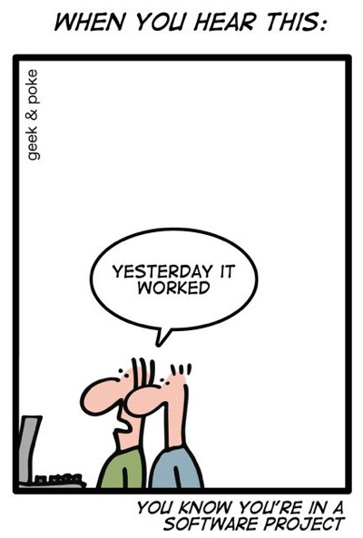

--

# Software Testing

--

## Why write tests?

Testing your software ensures

* Meeting the requirements that guided its design and development,
* correct responses to all kinds of inputs,
* functionality in acceptable time,
* sufficient usability, and
* installing and running it in intended environments.

--

## Static vs. Dynamic Testing

* Static testing can be compared to linting
	* Search for inconsistencies and common errors by walking through the code instead of running the code
* Static tests involve verification
* Dynamic testing runs code and tests with various inputs and outputs
* Dynamic tests involve validation

--

## Black box vs. White box Testing

* White box testing tests internal structure of code
	* Includes pieces of code a user does not directly interact with 
* Black box testing treats software as a black box
	* No knowledge on internal code functionality is required

--

## Some Testing Levels

* Unit tests
	* Verification of the functionality of a specific section of code
* Integration tests
	* Ensuring that different components of a software work together properly
* System tests
	* Validation of the entire system from start to end to verify that software meets all requirements

We focus on unit tests via the built-in `unittest` module

--

