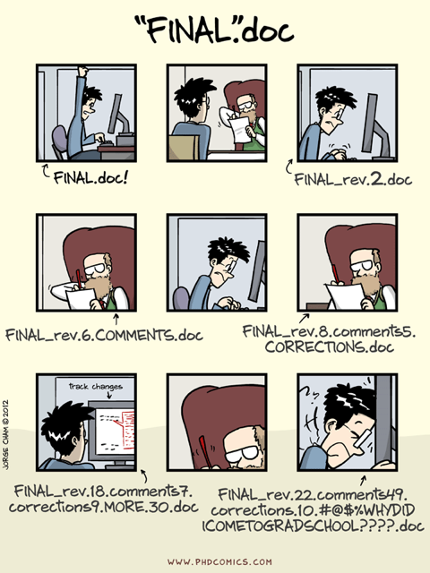
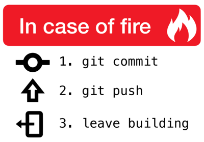
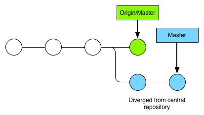

Note:
Image taken from [http://phdcomics.com/comics/archive.php?comicid=1531](http://phdcomics.com/comics/archive.php?comicid=1531)

Instead of having multiple copies of nearly-identical versions of the same document, some word processors enable tracking of changes (Microsoft Word, Google Doc, LibreOffice)

--

# Some Disadvantages

* No metadata about *what* was changed *when* by *whom*
* You lose track of what is going on
* You cannot easily roll-back to a specific working state
* Poor solution for collaboration

--

# Version Control

* Tracking of changes in files and set of files over time
* Record of snapshots of a current project's state via *commits*
* Sharing of changes in repositories
* Centralised (SVN, CVS) vs. decentralised (Git, hg)
* Implicit backup with possibility to roll-back to previous versions

--

# Git

We focus on `git` as an example for a decentralised version control

* Widely used in the Open Source world
* Easy to learn
* Variety of available tools
	* [Bitbucket](https://bitbucket.org), [GitHub](https://github.com), [GitLab](https://gitlab.com), ...

--

## Using `git` locally

	# Initialise an empty git repository
	$ git init

	# Put a file into your staging area
	$ git add <file>

	# This makes your commit.
	# To show what's in your staging area, use `git status`
	$ git commit -m "message"

	# You can also check what you did lately
	$ git show

--

## Useful configurations

Introduce yourself...
	
	# Configure your user name and email
	$ git config --global user.name 'Your Name'
	$ git config --global user.email 'Your email'

Configure auto correction for `git` commands

	$ git config --global help.autocorrect 1

Use colors to show `git` information

	$ git config --global color.ui auto

--

## Suppressing the noise

* Don't track junk or personal settings 

	$ echo ".idea/" >> .gitignore

* There are predefined templates for programming languages, operating systems, etc.

--

## Daily workflow

* Pull
* Repeat
	* Work
	* Add changes
	* Commit
* Push

--

## Improving your daily workflow

Larger projects usually require more complex workflows than the centralised workflow to manage simultaneous code changes e.g. for different features

* Feature Branch Workflow <!-- .element: class="fragment" -->
* Gitflow Workflow <!-- .element: class="fragment" -->
* Forking Workflow <!-- .element: class="fragment" -->

--

### Centralised Workflow

* You are working on your own local copy of a central repository
* Your commits are stored locally
* At some point in time you publish your changes to the central repository

	$ git push origin master

--

#### Managing Conflicts

* Before you can publish new features, the updated central commits need to be fetched to rebase your changes on top

	$ git pull --rebase origin master

* This sometimes requires to resolve merge conflicts manually

--

#### Managing Conflicts (2)

	CONFLICT (content): Merge conflict in <some-file>

* `git` pauses rebasing until you resolve the merge conflicts
* When you are happy with the results, continue the rebasing

	$ git add <resolved file>
	$ git rebase --continue

* Otherwise, you can still abort and you are back where you started

	$ git rebase --abort

--

### Feature Branch Workflow

* Each feature lives in a dedicated branch

	$ git checkout -b <feature> master

* Encapsulation enables developers to work on a particular feature without interfering with main codebase
* Master branch is spared from broken code
* Leveraging of pull requests

--

#### Merging a feature branch

	$ git checkout master
	$ git pull
	# the actual merge of the new feature
	$ git pull origin <feature>
	# pushing it back to origin
	$ git push

--

### Gitflow Workflow

Note:
Source [http://nvie.com/posts/a-successful-git-branching-model/](http://nvie.com/posts/a-successful-git-branching-model/)

--

### Gitflow Workflow (2)

* Strict branching model around the concept of a project release
* Robust framework for management of larger projects
* Definition of specific roles for the different branches and their interaction

--

#### Finishing a feature branch

	# a new branch is merged into develop
	$ git checkout develop
	# create a new commit to retain historical infos
	$ git merge --no-ff <feature>
	# delete the branch after merging
	$ git branch -d <feature>
	$ git push origin develop

--

### Forking Workflow

* Distributed workflow
* Not a single server-side repository but one server-side repository for each developer
* Project maintainer can push contents of developer repositories to central repository

--

### What works for us

* Combination from Feature and Gitflow Workflow
* Differentiation between `master` and `develop`
* Inclusion of `feature` branches
* No further release or hotfix branches

--

## The Pull Request Workflow

* You create a feature in a dedicated branch in your repository
* You push your finalised branch into a public repository
* You file a pull request
* The team reviews the code, discusses it and eventually files change requests
* The repository maintainer merges the feature into the official repository and closes the pull request

--

## Take-away Messages

* Commit often
* Try not to mix up different things into one commit, make up logical units
* Think about your commit messages
	* Include references to tickets if available

	$ git commit -m "$(curl -sL https://bit.ly/funny-mesg | sh)"

* Branching is cheap
